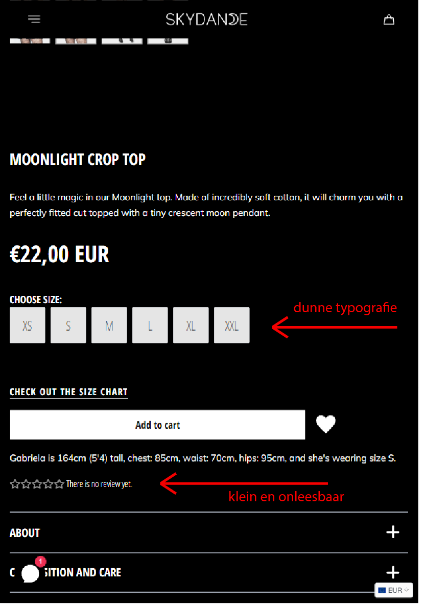
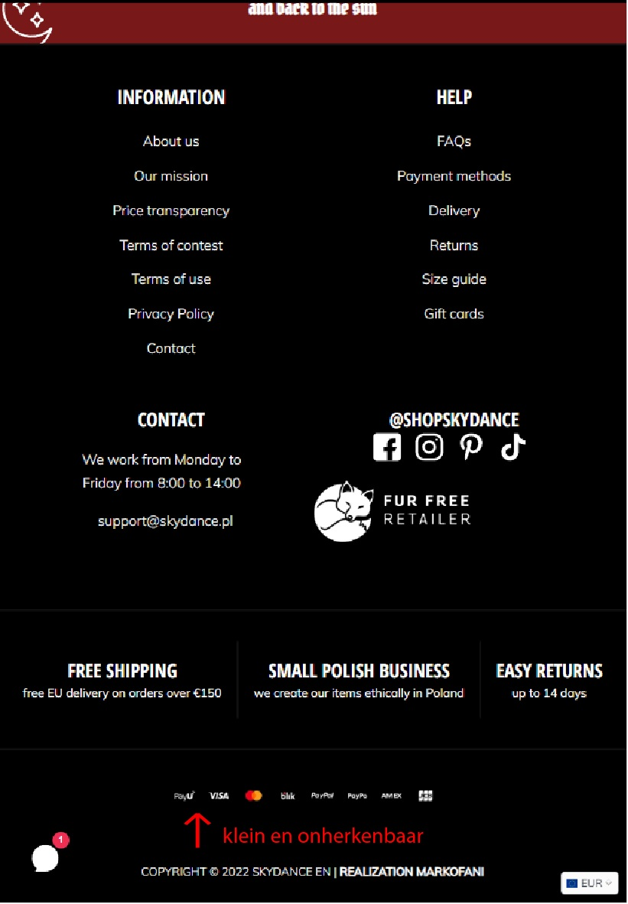
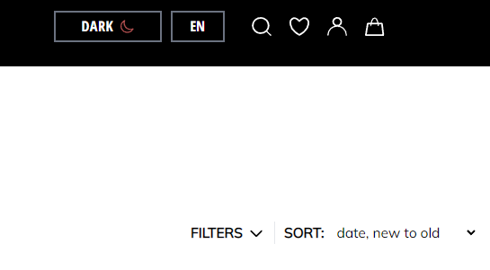
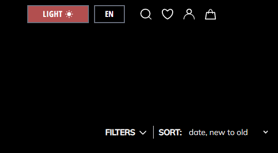
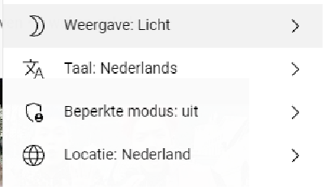
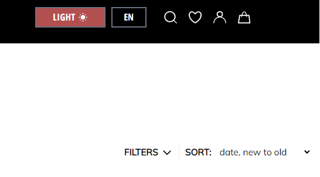

# Procesverslag
Markdown is een simpele manier om HTML te schrijven.  
Markdown cheat cheet: [Hulp bij het schrijven van Markdown](https://github.com/adam-p/markdown-here/wiki/Markdown-Cheatsheet).

Nb. De standaardstructuur en de spartaanse opmaak van de README.md zijn helemaal prima. Het gaat om de inhoud van je procesverslag. Besteedt de tijd voor pracht en praal aan je website.

Nb. Door *open* toe te voegen aan een *details* element kun je deze standaard open zetten. Fijn om dat steeds voor de relevante stuk(ken) te doen.

## Jij

  
 🌞Details 

  ### Auteur:
  Michelle de Boer

  #### Je startniveau:
  Tussen blauw en rood in 😼

  #### Je focus:
  Het liefste allebei, maar voor nu de surface plane
  
  ####Surface plane checklist
  - Advanced positioning (sticky header + z-index)
  - Dark/light mode
 

## Je website

  
🌞Details

  ### Je opdracht:
  https://en.skydance.pl/ (een small, family-run business voor alternative fashion)

  #### Screenshot(s) van de eerste pagina (small screen): 
  HOME PAGE (landings/nieuwe producten pagina)  
  

  #### Screenshot(s) van de tweede pagina (small screen):
  PRODUCT (detailpagina van een product)
  
  
  
 

## Toegankelijkheidstest 1/2 (week 1)

  
🌞Details

  ### Bevindingen
  Lijst met je bevindingen die in de test naar voren kwamen:

  #### Screenreader
  Hier korte omschrijving (met indien nodig afbeeldingen)

  Hier een omschrijving van hoe het opgelost kan worden (met indien nodig afbeeldingen)
  
  #### Concentratieproblemen
  De gebruiker vond dat er veel plaatjes waren, maar dat is best logisch voor een webshop die producten aan biedt.
  Er kan wel gekeken worden naar andere kleding webshops om te kijken hoe zij hun producten weergeven en of dit dan bij mijn website beter kan.
  
  De gebruiker miste verder een hover effect op buttons en de call to action was niet sterk aanwezig.
  Ook was de font bij de beschikbare maten erg dun en dus onleesbaar (vooral op kleine schermen kan dit een probleem gaan vormen).
  De rating van producten is verder ook erg klein en belemmert de readability. 
  Verder moeten de betaalmethodes hun kleur behouden -- de website heeft de iconen zwart-wit gemaakt zodat het in de huisstijl past. 
  Dit kan een prima keuze zijn maar in dit geval miste de gebruiker de herkenning van deze iconen omdat ze verdwijnen in het monochroom kleurenschema.
  
  Afbeelding(en) ter ondersteuning:
  
  
  

  #### Muis en Toetsenbord 
  Toetsenbord: De site is makkelijk te navigeren a.d.h.v. Tab & Enter.

  #### Motoriek (shocks, elastiekjes)
  Shocks: niet getest
  
  Elastiek: scrollen lukt, het verplaatsen lukt wat lastiger. Een beetje onduidelijkheid m.b.t. de buttons voor kledingmaten. De donkergrijze button betekent "uitverkocht" en als je erop klikt, komt erboven “sold out” te staan. Dit is alleen maar weergegeven als kleine, zwarte tekst.

  Hier een omschrijving van hoe het opgelost kan worden (met indien nodig afbeeldingen)

  #### Visueel (brillen, contrast, kleurenblind, dark/light). 
  Hier korte omschrijving (met indien nodig afbeeldingen)
  
  Kleurenblindheid: ✔️
  De website is heel colourblind friendly door het weinige kleurgebruik.
  
  Dark/light Mode: ✔️
  De website heeft een dark/light modus. De buttons weergeven dit alleen niet helemaal handig.
  
  Dit is hoe het momenteel eruit ziet:

  
  
  
  
  Oplossing: 
  Een oplossing is om de huidige modus aan te tonen, i.p.v. de andere modus. Zoals bij YouTube:
  
  
  
  
  Door de huidige modus te tonen (in dit geval is dat de light modus), snapt de gebruiker meteen welke modus nu in gebruik is. 
  
  Door de rode kleur te gebruiken als call to action, is de button ook makkelijker te vinden.
  

## Breakdownschets (week 1)

  
🌞Details

  ### de hele pagina: 
  

  ### dynamisch deel (bijv menu): 
  

  ### wellicht nog een dynamisch deel (bijv filter): 
  

## Voortgang 1 (week 2)

  
🌞Details

  ### Stand van zaken
  hier dit ging goed & dit was lastig (neem ook screenshots op van delen van je website en code)

  ### Agenda voor meeting
  Iedereen heeft wat vragen bedacht die zij willen stellen.
  
  #### Groep:
  | Deniz | Michelle | Mike | Quinesha|
  
  #### Vragen van Deniz:
  - Hoe zet ik tekst bij mijn footer?
  - Hoe maak ik de Amsterdam/Barcelona button?
  - Hoe maak ik de header en main bij mijn About Moco page?
  
  #### Vragen van Michelle:
  - Hoe maak ik een uitklapbaar menu?
  - Hoe maak je een slideshow van tekst?
  - Hoe zorg ik ervoor min. 2 en max. 4 items op een rij krijg?
  
  #### Vragen van Mike:
  - Hoe maak ik een responsive menu?
  
  #### Vragen van Quinesha:
  - Hoe zet ik de pijltjes van mij carousel aan de zijkanten?
  - Hoe zet ik een carousel naast een list?
  - Waarom krijg ik een witte balk wanneer ik naar een kleine scherm ga?
  

  ### Verslag van meeting
  hier na afloop snel de uitkomsten van de meeting vastleggen

  - Iedereen zijn/haar vragen zijn beantwoord.
  - De vragen zijn stapsgewijs doorgenomen.
  - Mijn vragen zijn opgelost d.m.v. een aantal CodePennetjes:
  
  Oplossingen
  
  - Er is a.d.h.v CSS en JS een geanimeerde menu gemaakt.
  - De marquee tag zorgt ervoor dat mijn tekst zich gedraagt als een soort slideshow.
  - Dankzij wat styling kan ik 2/4 items op een rij krijgen door grid-template-columns.

## Voortgang 2 (week 3)

  
🌞Details

  ### Stand van zaken
  Ik ben er vorige 
  hier dit ging goed & dit was lastig (neem ook screenshots op van delen van je website en code)

  ### Agenda voor meeting
  Iedereen heeft wat vragen bedacht die zij willen stellen.

  #### Groep:
  | Britney | Michelle | Rosalie | Tijme |
  
  #### Vragen van Britney:
  - Kan ik een class/id gebruiken voor tekst?
  - In hoeverre moet ik het uitwerken?
  
  #### Vragen van Michelle:
  - Kan ik een class/id gebruiken voor wat images en tekst?
  - Hoe haal ik de witruimte tussen mijn marquee en banner image weg?
  - Hoe krijg ik streepjes (hr) tussen de stukjes tekst in mijn footer?
  - Hoe zorg ik dat er een andere afbeelding tevoorschijn komt als ik boven een item hover?
  
  #### Vragen van Rosalie
  - Hulp bij dark mode
  - Hoe kom ik aan de background image?
  
  #### Vragen van Tijme 
  - Hoe zet ik mijn vakjes in het midden?
  
  
  
  
  
  ### Verslag van meeting
  hier na afloop snel de uitkomsten van de meeting vastleggen

## Toegankelijkheidstest 2/2 (week 4)

  
🌞Details

  ### Bevindingen
  - De website is best goed te navigeren bij concentratieproblemen: de afbeeldingen zijn informatief genoeg.

  #### Screenreader
  - Niet elke image heeft een alt tekst.

  Oplossing:
  - Een alt="" plaatsen bij elke afbeelding.

  #### Muis en Toetsenbord 
  - Kan niet tabben door de website: hij pakt alleen het e-mail veldje.
  - Er kan wel op de originele website getabd worden (ook Enter werkt).

  Oplossing:
  - De <h1>tjes vervangen met <a href>'s.
  - 

  #### Motoriek (shocks, elastiekjes)
  - 

  Hier een omschrijving van hoe het opgelost kan worden (met indien nodig afbeeldingen)

  #### Visueel (brillen, contrast, kleurenblind, dark/light). 
  - De readability van de tekst is goed bij wazigheid als de letters wat vergroot worden.
  - Kleurenblindheid is geen probleem omdat de website grotendeels monochroom is.
  - Ook in zwart-wit is het contrast duidelijk genoeg.

  Hier een omschrijving van hoe het opgelost kan worden (met indien nodig afbeeldingen)
  

## Voortgang 3 (week 4)

  
🌞Details

  ### Stand van zaken
  hier dit ging goed & dit was lastig (neem ook screenshots op van delen van je website en code)

  ### Agenda voor meeting
  samen met je groepje opstellen
 
  #### Groep:
  | Deniz | Michelle | Mike | Quinesha|
  
  #### Vragen van Deniz:
  - Hoe fix ik mijn header?
  - Hoe zet ik zo'n lijn bij mijn footer?
  - Hoe maak ik de cookies button?
  
  #### Vragen van Michelle:
  - Hoe zorg ik ervoor dat teksten niet over mijn sticky header floaten?
  - 
  
  #### Vragen van Mike:
  - Hoe maak ik een automatische image carousel?
  
  #### Vragen van Quinesha:
  - Hoe plaats ik een button het beste op een specifieke plek?
  - Hoe maak ik/plaats ik een cirkel met een icoon erin?
  - Hoe zorg ik dat een plaatje alleen aan de bovenkant een button overlapt?

  ### Verslag van meeting
  hier na afloop snel de uitkomsten van de meeting vastleggen

  - punt 1
  - punt 2
  - nog een punt
  - ...

## Eindgesprek (week 5)

  
uitwerken voor eindgesprek

  ### Je uitkomst - karakteristiek screenshots:
  

  ### Dit ging goed/Heb ik geleerd: 
  Korte omschrijving met plaatjes

  

  ### Dit was lastig/Is niet gelukt:
  Korte omschrijving met plaatjes

  

## Bronnenlijst

  
continu bijhouden terwijl je werkt

  Nb. Wees specifiek ('css-tricks' als bron is bijv. niet specifiek genoeg).

  1.  https://en.skydance.pl/ (de gebruikte website die ik namaak)
  2. https://www.youtube.com/ (screenshot van website om de light/dark modus aan te tonen)
  3. ...

